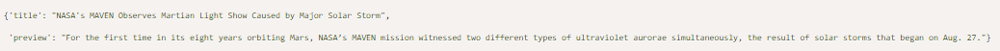
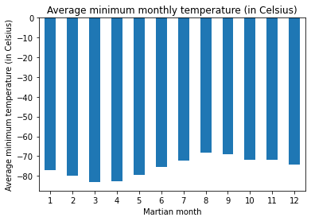
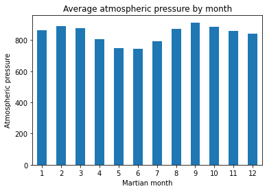

# Web scraping Mars news and weather data

 ### **Overview**
Used web scraping to extract both news and weather information from sites about Mars. The information was extracted via both automated browsing with Splinter and HTML parsing with Beautiful Soup.

### **Part 1***
Scraped the title and preview text from news articles from [Mars news site](https://static.bc-edx.com/data/web/mars_news/index.html)
 - Beautiful Soup was used to extract text elements from the website
 - the title and preview text for each news article was stored in a Python dictionary.
 

### **Part 2**
 Part 2 - extracted weather data from [Mars temperature data site](https://static.bc-edx.com/data/web/mars_facts/temperature.html)
 - Used automated browsing to visit the page identify the elements to scrape
 - Beautiful Soup was used to scrape the data
 - The scraped data was assembled into a dataframe
 - Ensured data had the appropriate data type
 - Analysed the data
 

 
 ### **Folder structure**
- **part_1_mars_news.ipynb* - the code and output for part 1
 - *part_2_mars_weather.ipynb* - the code, output, and analysis for part 2
  

The folder *output* contains:
- *mars_news.json* - title and preview text as a pair for part 1
- *mars_temp.csv* - DataFrame exported to a csv for part 2

 

---

### **Contact**
Email: kymcoleman@gmail.com

---